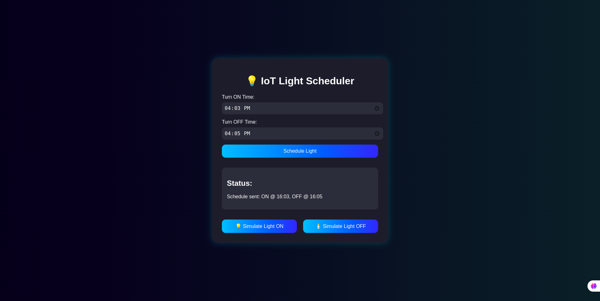

# 💡 Web-Based IoT Light Scheduler

A fully functional **Web-based IoT Light Scheduler** that lets you schedule a light to turn **ON** and **OFF** at specific times using a user-friendly interface and communicates with an Arduino via MQTT and serial connection.

---

## 📌 Objective

Simulate a **real-world IoT dashboard** to schedule a light using a **graphical interface**, **WebSocket server**, and **MQTT communication**. The light (relay) is controlled by an Arduino that responds to `ON/OFF` commands based on the schedule.

---

## 🌐 Tech Stack Overview

| Layer      | Technologies Used                          |
|------------|--------------------------------------------|
| Frontend   | HTML, CSS, JavaScript                      |
| Backend    | Python (websockets, os, pyserial)          |
| Messaging  | MQTT (Mosquitto broker, mosquitto_pub/sub) |
| Hardware   | Arduino UNO via Serial (USB)               |

---

## 🖥️ User Interface

- Time inputs to schedule when to turn the light **ON** and **OFF**
- Submit button to send the schedule
- Live status display

🔧 **Cool Extras:**
- Responsive design with modern gradients
- Real-time feedback after submission

---

## 🧠 How It Works

1. User selects `ON` and `OFF` times using the interface.
2. Times are sent to a Python **WebSocket server**.
3. Server **publishes** the schedule to the MQTT topic: `light/schedule`.
4. Python **MQTT subscriber** listens to this topic.
5. When current time matches schedule:
   - Sends `'1'` to Arduino to turn **ON**
   - Sends `'0'` to Arduino to turn **OFF**
6. Arduino toggles the relay based on serial input.

---

## 📁 Project Structure

```
light-scheduler/
├── frontend/
│   ├── index.html        # Main HTML file
│   ├── style.css         # Custom CSS styles
│   └── script.js         # JavaScript (WebSocket + UI)
├── backend/
│   ├── websocket_server.py # WebSocket to MQTT forwarder
│   └── mqtt_subscriber.py  # MQTT subscriber to Arduino
├── demo.gif              # Optional demo animation
└── README.md             # This file
```

---

## ⚙️ Installation Instructions

### 🔹 1. Clone the Repository

```bash
git clone https://github.com/YOUR_USERNAME/light-scheduler.git
cd light-scheduler
```

### 🔹 2. Install Python Dependencies

```bash
pip install websockets pyserial
```

### 🔹 3. Start Mosquitto Broker

Install Mosquitto MQTT (if not installed):

```bash
sudo apt install mosquitto mosquitto-clients
```

Then run:

```bash
mosquitto
```

### 🔹 4. Run Backend

Start WebSocket Server:

```bash
python3 backend/websocket_server.py
```

Start MQTT Subscriber:

```bash
python3 backend/mqtt_subscriber.py
```

### 🔹 5. Open UI

Simply open `frontend/index.html` in your web browser (Chrome preferred).

Alternatively, start a local server:

```bash
cd frontend
python3 -m http.server 8000
```

Open [http://localhost:8000](http://localhost:8000) in your browser.

---

## 🧪 Example Flow

- You set ON time: 18:00, OFF time: 18:05
- At 18:00 — Arduino receives `1` → Relay ON
- At 18:05 — Arduino receives `0` → Relay OFF

---

## 🔋 Additional Features

- ✅ Real-time scheduling with JavaScript WebSocket
- ✅ Cross-platform Python server
- ✅ Secure communication channel
- ✅ Extra validations in frontend
- ✅ Extendable to multiple devices

---

## 💬 MQTT Topics Used

- **Publish Topic:** `light/schedule`
- **Message Format:** `"HH:MM,HH:MM"` (e.g., `"18:00,18:05"`)

---

## 🪛 Arduino Compatibility

- The Arduino code is already configured to:
  - Read serial input
  - Turn ON the relay when `'1'`
  - Turn OFF the relay when `'0'`

> ✅ Ensure the correct serial port is set in `mqtt_subscriber.py` (`/dev/ttyACM0` or COM port for Windows)

---

## 📸 Demo (Optional)

Record your demo using a screen recorder and save as `demo.gif`:

```bash
# Save your demo GIF in the root directory
light-scheduler/demo.gif
```

---

## ✍️ Author

- 👤 **Nibishaka Raphael**
- 📧 raphyboy159@gmail.com
- 🔗 [GitHub](https://github.com/raphyboy159)

---

## 📅 Submission Reminder

Submit your **GitHub Repo URL** via the Google Form before:

🕛 **April 30, 2025 – 23:59:59**

Good luck! 🚀
# IoT-Light-Scheduler
